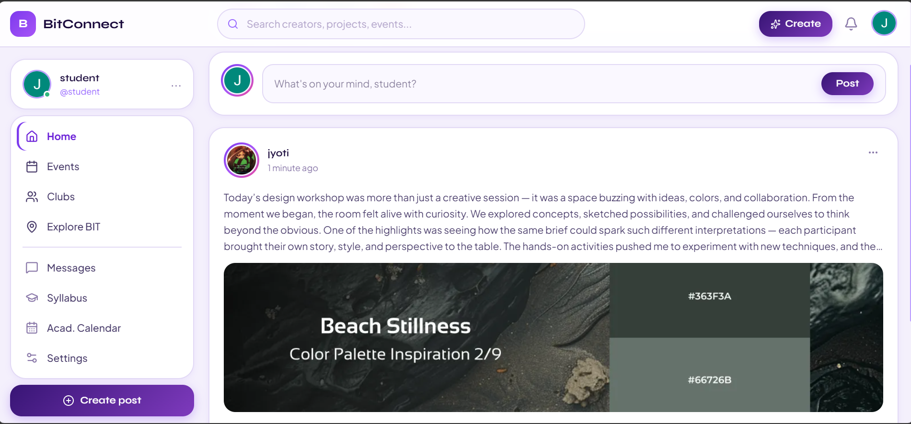
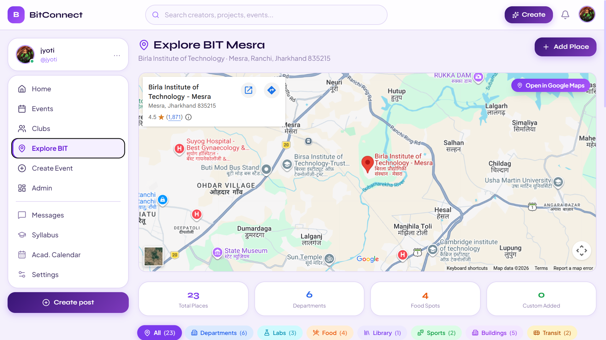

<div align="center">
# BitConnect 🔗

> **The social network built for your institute** — connect with batchmates, discover clubs, attend events, and build your college network in one place.

---

## What is BitConnect?

BitConnect is a full-stack social web platform designed specifically for institute communities. Think of it as a campus-scoped social network where students can share posts, join clubs, RSVP to events, and follow each other — all within the context of their college. It's built with real-time features, role-based access, and a clean, modern UI.

<!-- 
🌐 **Live Site → [musix-7xhg.onrender.com](https://musix-7xhg.onrender.com)** -->

</div>

---

## 📸 Screenshots

<div align="center">

### Home Page


### Search — explore bit


<!-- ### Playlist View


### Real-Time Chat


### Admin Dashboard
 -->

</div>

---


## Features

**Social Feed**
- Create, like, and comment on posts with rich text (powered by Tiptap editor)
- Infinite scroll feed with skeleton loading states
- Bookmark posts for later
- Image uploads via Cloudinary

**Clubs**
- Browse and join student clubs
- Club admins can manage membership and post announcements
- Slug-based club URLs for clean sharing

**Events**
- Create and discover campus events
- Real-time RSVP system powered by Socket.io
- Event detail pages with attendee counts

**Profiles**
- Customizable profiles with bio, skills, graduation year, and college info
- Social links (LinkedIn, GitHub, Twitter)
- Follow/unfollow with follower and following counts
- Bookmarks page

**Notifications**
- Real-time notification bell via WebSocket
- Dropdown with unread count badge

**Authentication**
- Email/password registration and login
- OAuth login via Google and GitHub
- Forgot/reset password via email (Nodemailer)
- JWT access tokens (15 min) + refresh tokens (7 days) stored as HTTP-only cookies
- Token rotation and secure refresh flow

**Admin Dashboard**
- Role-based access control (student / club / admin)
- Admin-only routes for platform management

---

## Tech Stack

### Frontend
| Tool | Purpose |
|---|---|
| React 19 + Vite | UI framework and build tool |
| Redux Toolkit | Global state management |
| React Router v7 | Client-side routing |
| Tailwind CSS v4 | Utility-first styling |
| Socket.io Client | Real-time WebSocket connection |
| Tiptap | Rich text post editor |
| React Hook Form + Zod | Form handling and validation |
| Axios | HTTP client with interceptors |
| date-fns | Date formatting |
| Lucide React + React Icons | Icon libraries |

### Backend
| Tool | Purpose |
|---|---|
| Node.js + Express | REST API server |
| MongoDB + Mongoose | Primary database |
| Redis (ioredis) | Session/token caching |
| Socket.io | Real-time events (notifications, RSVP) |
| Passport.js | OAuth strategies (Google, GitHub) |
| JWT (jsonwebtoken) | Auth token generation and verification |
| Cloudinary + Multer | Image upload and storage |
| Nodemailer | Transactional email |
| Zod | Server-side request validation |
| Helmet, HPP, mongo-sanitize | Security hardening |
| express-rate-limit | API rate limiting |
| node-cron | Scheduled background tasks |
| Sharp | Image processing |

---

## Project Structure

```
BitConnect_/
├── client/                   # React frontend
│   └── src/
│       ├── api/              # Axios API modules (auth, posts, clubs, events…)
│       ├── components/       # Reusable UI components
│       │   ├── clubs/
│       │   ├── common/       # Button, Input, Modal, Avatar, Spinner…
│       │   ├── events/
│       │   ├── feed/
│       │   ├── layout/       # Navbar, Sidebar, RootLayout, ProtectedRoute
│       │   └── notifications/
│       ├── context/          # AuthContext, SocketContext
│       ├── hooks/            # useAuth, useSocket, useInfiniteScroll, useDebounce…
│       ├── pages/            # Route-level page components
│       ├── store/            # Redux store + slices (auth, posts, events, notifs)
│       └── utils/            # Helpers (cn, formatDate, roleGuard, constants)
│
└── server/                   # Express backend
    └── src/
        ├── config/           # DB, Redis, Cloudinary, Passport config
        ├── controllers/      # Route handlers
        ├── middleware/        # Auth, RBAC, error handler, rate limiter, upload
        ├── models/           # Mongoose schemas (User, Post, Club, Event, Notification)
        ├── routes/           # Express routers
        ├── services/         # Business logic layer
        ├── sockets/          # Socket.io handlers (notifications, RSVP)
        ├── utils/            # ApiError, ApiResponse, catchAsync, sendEmail…
        └── validators/       # Zod schemas for request validation
```

<!-- ---

## Getting Started

### Prerequisites

- Node.js 18+
- MongoDB instance (local or Atlas)
- Redis instance
- Cloudinary account
- Google and/or GitHub OAuth app credentials (optional)

### 1. Clone the repo

```bash
git clone https://github.com/Jyoti-24-05/BitConnect_.git
cd BitConnect_
```

### 2. Set up the server

```bash
cd server
npm install
```

Create a `.env` file in `server/`:

```env
NODE_ENV=development
PORT=5000

MONGODB_URI=your_mongodb_connection_string
REDIS_URL=your_redis_url

ACCESS_TOKEN_SECRET=your_access_token_secret
ACCESS_TOKEN_EXPIRY=15m
REFRESH_TOKEN_SECRET=your_refresh_token_secret
REFRESH_TOKEN_EXPIRY=7d

CLOUDINARY_CLOUD_NAME=your_cloud_name
CLOUDINARY_API_KEY=your_api_key
CLOUDINARY_API_SECRET=your_api_secret

EMAIL_HOST=smtp.example.com
EMAIL_PORT=587
EMAIL_USER=your_email
EMAIL_PASS=your_password

GOOGLE_CLIENT_ID=your_google_client_id
GOOGLE_CLIENT_SECRET=your_google_client_secret

GITHUB_CLIENT_ID=your_github_client_id
GITHUB_CLIENT_SECRET=your_github_client_secret

CLIENT_URL=http://localhost:5173
```

Start the server:

```bash
npm run dev
```

### 3. Set up the client

```bash
cd ../client
npm install
```

Create a `.env` file in `client/`:

```env
VITE_API_URL=http://localhost:5000/api/v1
VITE_SOCKET_URL=http://localhost:5000
```

Start the client:

```bash
npm run dev
```

The app will be running at `http://localhost:5173`.

---

## API Overview

All API routes are prefixed with `/api/v1`.

| Resource | Base Route |
|---|---|
| Auth | `/api/v1/auth` |
| Users | `/api/v1/users` |
| Posts | `/api/v1/posts` |
| Clubs | `/api/v1/clubs` |
| Events | `/api/v1/events` |
| Notifications | `/api/v1/notifications` |
| Admin | `/api/v1/admin` |

Health check: `GET /health`

---

## User Roles

| Role | Description |
|---|---|
| `student` | Default role — can post, follow, join clubs, RSVP to events |
| `club` | Can create and manage a club |
| `admin` | Full platform access including the admin dashboard |

---

## Contributing

1. Fork the repo
2. Create a feature branch: `git checkout -b feature/your-feature`
3. Commit your changes: `git commit -m "feat: add your feature"`
4. Push and open a pull request

---

## License

MIT

--- -->

*Built with ❤️ by jyoti*